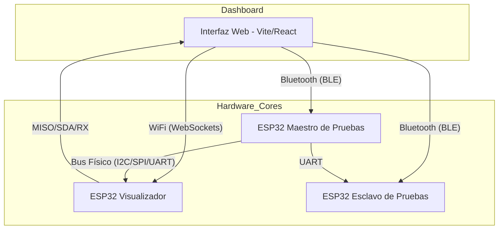

# 🔬 SerialScope — Sistema de Análisis de Protocolos

[](https://github.com/lupi5440/SerialScope)
[](https://www.espressif.com/en/products/socs/esp32)
[](https://vitejs.dev/)

**SerialScope** es un ecosistema avanzado de hardware y software diseñado para la visualización, análisis y emulación de protocolos de comunicación serial (**UART, I²C y SPI**). Esta versión 3.0 introduce capacidades de **Maestro Activo**, permitiendo interactuar con sensores reales (como el MAX6675) y emular dispositivos complejos directamente desde una interfaz web .

---

## 🏗️ Arquitectura del Sistema (V3)

El sistema utiliza una arquitectura híbrida para garantizar que la visualización no afecte el rendimiento del bus físico.



### 🛰️ Componentes Hardware
| Componente | Conectividad | Propósito |
|---|---|---|
| **Visualizador (Sniffer/Master)** | **WiFi** | Analizador lógico pasivo o **Maestro SPI/I2C** directo para leer sensores. |
| **Maestro (Emulador)** | **BLE** | Genera tráfico controlado, emula sensores (BMP180/TMP102) y controla periféricos (TFT). |
| **Esclavo (Receptor)** | **BLE** | Extremo final de la ráfaga UART para pruebas de integridad y bidireccionalidad. |

---

## 🚀 Capacidades Pro V3

### ⚡ Protocolo SPI (Serial Peripheral Interface)
- **Sniffing Pasivo:** Monitoreo en tiempo real de ráfagas MOSI/MISO sincronizadas con el reloj (SCK).
- **Maestro Activo:** Capacidad de generar el reloj (SCK) y CS para leer sensores (ej. MAX6675) y controlar periféricos (TFT).
- **Emulación de Sensor:** El visualizador puede actuar como Esclavo para responder a otros maestros con datos HEX personalizados.

### 🧩 Protocolo I²C (Inter-Integrated Circuit)
- **Auto-Sniffing:** Captura automática de direcciones y registros mediante interrupciones de hardware.
- **Maestro Activo:** Capacidad de lectura y escritura directa sobre dispositivos esclavos desde la interfaz web.
- **Emulación de Sensor:** Simulación de una memoria de registros (256 bytes) para pruebas de integración.

### 📡 Protocolo UART (Comunicación Serial)
- **Sniffing Pasivo:** Intercepción de mensajes entre dos dispositivos (Proxy transparente).
- **Maestro Activo:** Generación de mensajes seriales con baudrates configurables (9600 a 115200).
- **Emulación:** Respuesta automática controlada para validación de enlaces bidireccionales.

---

## 🛠️ Instalación y Uso

### Interfaz Web
La interfaz utiliza **Vite** para una experiencia rápida y un diseño basado en **Glassmorphism**.
```bash
cd WebInterface
npm install
npm run dev
```
Accede a `http://localhost:5173` para entrar al panel de control.

### Firmware (ESP32)
Es **CRÍTICO** utilizar el **ESP32 Arduino Core 3.0.0+** debido al uso de las nuevas APIs de PWM (`ledcAttach`). Puedes encontrar más información sobre este cambio [aquí](https://docs.espressif.com/projects/arduino-esp32/en/latest/api/ledc.html).

**Librerías Requeridas:**
- `Adafruit GFX Library` (v1.11.9)
- `Adafruit ST7735 and ST7789 Library` (v1.10.3)
- `MAX6675 library` (v1.1.2)
- [AsyncTCP (Fork de mathieucarbou)](https://github.com/mathieucarbou/AsyncTCP)
- [ESPAsyncWebServer (Fork de mathieucarbou)](https://github.com/mathieucarbou/ESPAsyncWebServer)

**Software de Desarrollo:**
- **Arduino IDE**: 2.3.2+ o VS Code + PlatformIO.
- **ESP32 Arduino Core**: 3.0.0 o superior.

---

## ✍️ Autor
[**Juan Angel Serrano Carreño**](https://github.com/lupi5440) 
[**Karla Patricia Pablo Ortega**](https://github.com/Karla789Pablo)
*ESCOM - Instituto Politécnico Nacional*  
*Ciudad de México, 2026*

