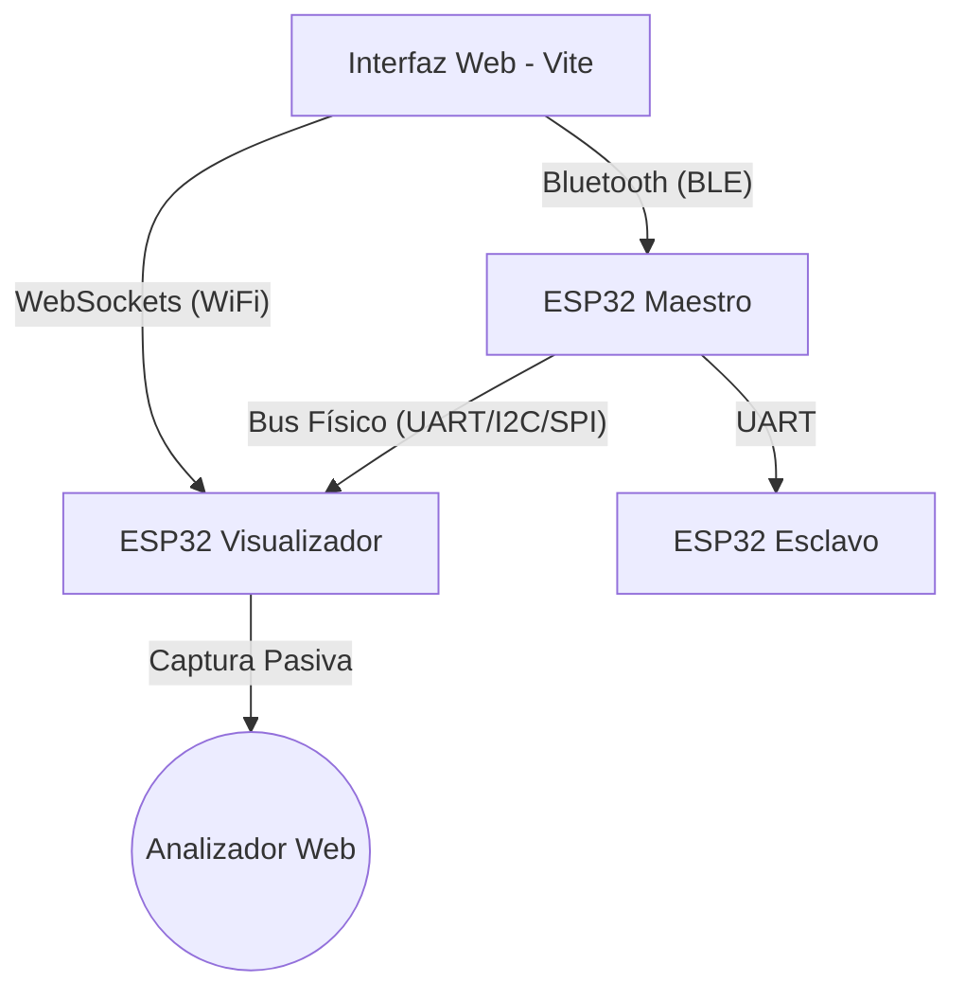

# 🔬 SerialScope — Sistema de Análisis de Protocolos

[](https://github.com/lupi5440/SerialScope)
[](https://www.espressif.com/en/products/socs/esp32)
[](https://vitejs.dev/)

**SerialScope** es una plataforma educativa y de herramientas para la visualización y aprendizaje de protocolos de comunicación serial (**UART, RS232, I²C y SPI**). Diseñada con una arquitectura híbrida que combina la potencia de **WebSockets (WiFi)** para el sniffing de datos a alta velocidad y **BLE (Bluetooth Low Energy)** para el control de pruebas.

---

## 🏗️ Arquitectura del Sistema

El sistema se divide en tres componentes principales que interactúan de forma transparente a través de la interfaz web:



### 🛰️ Componentes Hardware
| Componente | Conectividad | Propósito |
|---|---|---|
| **Visualizador (Sniffer)** | **WiFi** | Captura tráfico pasivo del bus y lo envía a la web en tiempo real. |
| **Maestro (Generador)** | **BLE** | "Cerebro" que genera tráfico real, lee sensores y controla periféricos. |
| **Esclavo (Destino)** | **BLE** | Responde a comandos UART para validar comunicación bidireccional y manda su información recibida a la interfaz. |

---

## 🚀 Inicio Rápido

### 1. Interfaz Web (Dashboard Premium)
La interfaz utiliza **Vite** para una experiencia rápida y un diseño basado en **Glassmorphism**.

```bash
cd WebInterface
npm install
npm run dev
```
Accede a `http://localhost:5173` para entrar al panel de control.

### 2. Firmware (ESP32)
Es **CRÍTICO** utilizar el **ESP32 Arduino Core 3.0.0+** debido al uso de APIs de PWM (`ledcAttach`).

**Librerías Requeridas:**
- `Adafruit GFX Library` (v1.11.9)
- `Adafruit ST7735 and ST7789 Library` (v1.10.3)
- `MAX6675 library` (v1.1.2)
- `AsyncTCP` (v1.1.4)
- `ESPAsyncWebServer` (v3.1.0)

**Software Requerido:**
- **ESP32 Arduino Core**: 3.0.0 o superior.
- **Android Studio**: Ladybug | 2024.2.1.
- **Arduino IDE**: 2.3.2+ o VS Code + PlatformIO.

---

## 🧪 Capacidades de Análisis

### 📡 Sniffing Pasivo (Visualizador)
- **UART / RS232**: Proxy transparente que intercepta y grafica bytes entre dos dispositivos.
- **I²C**: Captura a nivel de bit mediante interrupciones rápidas en SCL/SDA.
- **SPI**: Monitoreo de tráfico MOSI/MISO sincronizado con el reloj (SCK).

### 🛠️ Banco de Pruebas (Maestro)
- **Ejecucion de Sensores**: Tráfico a travez de **BMP180** (I2C) y **TMP102** (I2C).
- **Control de Periféricos**: Manejo de pantalla **TFT 1.8"** y lectura de **Termopar MAX6675** vía SPI.
- **Validación UART**: Envío manual de comandos y recepción de respuestas desde el esclavo generando un chat bidireccional.

---

## 📚 Módulos Educativos
SerialScope no es solo una herramienta, es una web para comprender los protocolos de comunicación:
- **Video de funcionamiento**: Muestra del funcionamiento de cada protocolo.
- **Fundamentos**: Comparativas detalladas entre comunicación síncrona/asíncrona y serial/paralela.
---

## 📌 Documentación de Conexiones (Pinouts)

Para obtener detalles precisos sobre el conexionado físico de cada módulo, consulta los siguientes archivos:

| Documento | Descripción |
|---|---|
| [📍 Pinout Visualizador](./Firmware/PINOUT_VISUALIZADOR.md) | Pines para el sniffing de UART, I2C y SPI. |
| [📍 Pinout Maestro](./Firmware/PINOUT_PRUEBAS_MASTER.md) | Pines para control de sensores, TFT y comunicación BLE. |
| [📍 Pinout Esclavo](./Firmware/PINOUT_PRUEBAS_SLAVE.md) | Configuración del nodo de respuesta UART. |

### Resumen rápido de pines:
#### Visualizador (WiFi)
| Función | GPIO |
|---|---|
| **LED WiFi (Blanco)** | 12 |
| **UART Sniff (RX1/TX1)** | 25 / 26 |
| **UART Sniff (RX2/TX2)** | 33 / 32 |
| **I2C Sniff (SCL/SDA)** | 22 / 4 |
| **SPI Sniff (SCK/MISO/MOSI/CS)** | 18 / 19 / 23 / 5 |

#### Maestro (BLE)
| Función | GPIO |
|---|---|
| **TFT (CS/RST/DC)** | 5 / 4 / 2 |
| **TFT Backlight (PWM)** | 13 |
| **MAX6675 (CS/DO/CLK)** | 5 / 19 / 18 |
| **LED BLE (Blanco)** | 32 |

#### Esclavo (BLE)
| Función | GPIO |
|---|---|
| **LED BLE (Blanco)** | 32 |
| **UART (RX/TX)** | 25 / 26 |
| **LED Rojo** | 4 |

---

## ⚠️ Notas de Seguridad y Hardware
- **Niveles Lógicos**: Todos los componentes operan a **3.3V**. El uso de 5V sin convertidores puede dañar el ESP32.
- **Consumo**: El uso de la pantalla TFT y el WiFi simultáneamente puede requerir una fuente de alimentación estable de al menos 500mA.
- **WiFi**: El Visualizador crea una red propia: `SerialScope_Visualizador`. Conéctate a ella para recibir datos en la web.

---

## ✍️ Autor
**Juan Angel Serrano Carreño**  
*ESCOM - Instituto Politécnico Nacional*

